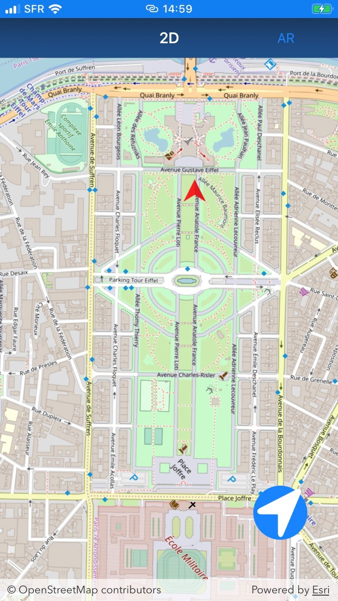
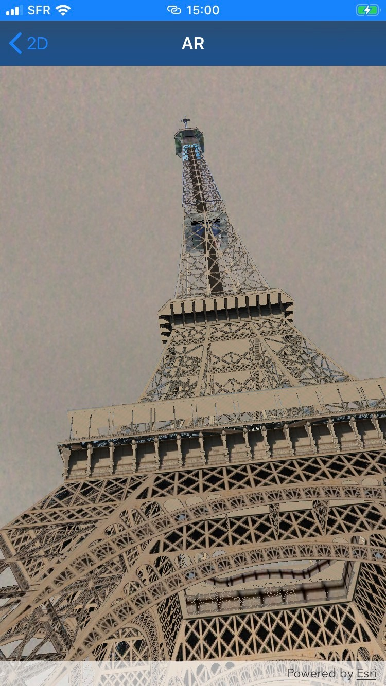

# Augmented Reality application with ArcGIS Runtime SDK for iOS 

This is an augmented reality application developed with ArcGIS Runtime SDK for iOS. You can retrieve the get started here: https://developers.arcgis.com/ios/latest/swift/guide/display-scenes-in-augmented-reality.htm


## Installation

### Clone

- Clone this repo to your local machine using `https://github.com/qQsss777/arapp.git`

### Setup
Create an ArcGIS Developer account: https://developers.arcgis.com/ .
You need a device which supports ARKit.

After you cloned this repositery, enter:

```shell
$ pod install
```

Then you must type your licence key in the MapViewController. Finally, add 3D data : complete the parameter in the ArViewController the AGSArcGISSceneLayer.

Debug your application.

---

## Use

When you run the application, your device position is on the map. You can launch AR mode from the navigation bar. If your positon is not correct, click the button on the bottom right. After you can, with a long press on the map, indicate your position. You should rotate the map too to get the heading.

 

---

## License

[](https://opensource.org/licenses/Apache-2.0)

